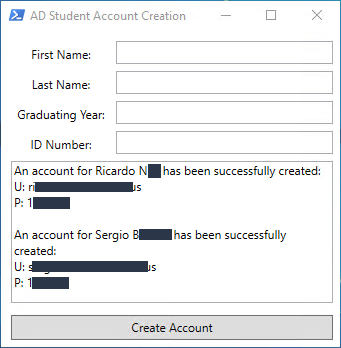

# ADStudentAccountCreation
A PowerShell GUI to create student accounts in Active Directory

This is a simple powershell script that will take your user input and create and account in Active Directory based of that input.

.FirstName
	First name of student

.LastName
	Last name of student
	
.GraduatingYear
	Year student will gradute 8th grade (Used to place in proper AD OU)
	Must be 4 number characters long

.ID Number
	The students ID Number (used for password)
	Must be 5 number characters long
	

